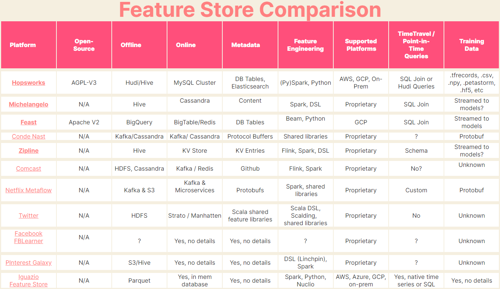
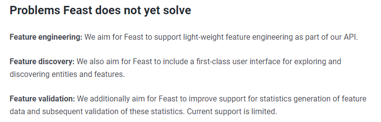

###############
CD4ML - MLOps
###############

.. image:: https://readthedocs.org/projects/iu-cd4ml/badge/?version=latest
    :target: https://iu-cd4ml.readthedocs.io/en/latest/?badge=latest
    :alt: Documentation Status

This is the documentation for all my projects in CD4ML field for Bachelor's thesis at International University 2021-2022

Read the complete documentation at: `iu-cd4ml.readthedocs.io <https://iu-cd4ml.readthedocs.io>`_

.. contents:: Table of Contents
    :local:

----------------------------------

***********
Overview
***********
In Software Engineering, DevOps and Continuous Delivery has become an integral part as it did a great job automating the boring parts of the SE process. The more complicated the project, the more useful DevOps is. Popular software platforms also provided extensive supports for CI/CD with GitHub Actions, or even the whole DevOps lifecycle with GitLab.

Machine learning is an emerging but attractive field as ML can bring solutions to problems beyond the SE ability. Having realized the immense value of DevOps in Software Engineering, ML experts are calling for an adaptation of CI/CD pipelines to the ML field in order to streamline the process between ML development and deploying ML in production, naming the new field CD4ML or MLOps. Nevertheless, due to some instrinsical differences between ML and SE, MLOps faced a lot of obstables. Some of the perks of ML include: probabilistic nature, non-deterministic results, heavy reliant on data (which is hard to manage), non-code backgrounds of ML practitioners, etc.

***************
Vision & Ideas
***************

Vision
======

In my thesis, I set out to solve some of the current problems faced by MLOps systems.

A new concept has been created in ML systems in order to reduce the duplicated work between ML teams and projects, that is **feature store**. Feature store is like a data warehouse, but focus specifically on storing ML features (columns after doing feature engineering on datasets). As data scientists are currently spending the majority of time on feature engineering, if the feature engineering work can be shared and reused by other teams or projects, it would boost the productivity of data scientists many times.

There are a lot of featurestore solutions currently existing. Nevertheless, most of them are proprietary and are deployed within the scope of the organizations. There are many reasons for this, most of those surrounds three aspects: infrastructure, data and incentives. Firstly, featurestore comes hand in hand with ETL pipelines, but ETL pipelines solutions are now still very customized to each organiztion's infrastructure, not portable enough to release in an open-source solution. Secondly, data comes in every shapes and sizes, thus, it is hard to release an open-source solution that can fit every system's data. Reversely, organizations decided to better design a customized featurestore that support well the kind of data frequently appeared inside of their organizations. Last but not least, organizations do not have an incentive to develop, release and maintian an open-source featurestore. The only open-source featurestore as of now, late 2021, is Feast, developed by Tecton and used internally by Gojek.

Here is a comparison of featurestores from `featurestore.org <https://featurestore.org>`_:

    Feature store comparison table.

As the only available open-source featurestore, Feast gain traction easily. However, Feast is kind of a low-priority project for the maintaining organizations. Despite being developed for almost 3 years, it is still very basic, lacking a lot of features. Even feast admitted that they lack some crucial features, taken from `docs.feast.dev <https://docs.feast.dev>`_:

    Feast problems.

Besides, there are other problems that I found after having used feast for a while:

* Only support time-series data. Many teams has requested them to support other kinds of data, especially for datasets without timestamps
* Tightly coupled to Tecton and Gojek workflow:

  #. Gathering timestamped data
  #. Do feature engineering and store features in offline store
  #. Schedule job to move newest (usually within last 24 hours) rows of features from offline store to online store
  #. Label and train model on features in offline store
  #. Use trained model to predict labels of newest features in online store

* Many projects that have workflows requiring on-demand inferences will not fit into Feast design.
* No guarantee between the feature and its feature engineering pipelines. When feature users and feature engineers are from 2 different teams (which is one of the originial goals of feature stores, sharing features between teams and projects), features users will not be guaranteed to know about the feature engineering logics:

  #. who are the feature engineers for a feature?
  #. what techniques, sources, etc. created that feature?
  #. when was that feature first appeared, when is it scheduled to update, to materialize?
  #. how was the feature engineered, aka what is its logic? how to update the feature?
  #. why was that feature created, what was the purpose of it or why doesn't a crucial feature exist in the feature store?

Due to all the reasons above, Feast, despite being popular, is being adopted very slowly, usually by teams that have data fit into Feast workflow and allow to spend time on customizing Feast. Three years in existence, even as the only choice for feature store, Feast only has 2.1k stars on GitHub.

Ideas
=====

festaf
------

In order to push for wider adoption of feauture store in ML projects, I set out to create a new open source feature store that can solve at least some or all the problems of Feast. This is the **festaf** project, **festaf** stand for **fe**\ture **st**\ore on **a**\ir\ **f**\low. I chose Apache AirFlow, the currently most popular workflow orchestration tool for data systems, as the underline ETL pipeline for my feature store. Yes, it is better to support all workflow orchestration tools. However, due to the massive amount of differences between them, I chose not to and focus on the most popular one only.

anemoi
------

In order for **festaf** to work, we need a way to share and reuse AirFlow pipelines (called *DAG*) easily. Therefore, the **anemoi** project is created to provide:

#. A platform for sharing and discovering AirFlow DAGs
#. An AirFlow plugin to import, export DAGs

Leverage **anemoi**, **festaf** will be able to provides links to the AirFlow DAGs that were the ETL pipelines to create the features. More details will be described in the **festaf** documentation.

**anemoi** project is expected to be ahead of **festaf** as **festaf** requires at least an MVP from **anemoi**.

*J4F: In ancient Greek religion and myth, the Anemoi (Greek: Ἄνεμοι, "Winds") were wind gods who were each ascribed a cardinal direction from which their respective winds came (see Classical compass winds), and were each associated with various seasons and weather conditions. => Wind gods control AirFlow ^^*

e2e-ml
------

This is simply an Electron app using different :code:`BrowserView` components to render MLOps tools in an ML life cycle. For example, one view for AirFlow, another view for a Feature Store and another view for a Metadata Store.

The purpose of this project is to showcase the enhancements that MLOps can bring to the ML lifecycle.

jupIDE
------

Currently, most data scientists start the project will jupyter notebooks. I have stumbled upon a lot of "ML projects" that lie within a single jupyter notebok. It creates tons of problems:

* hard to index
* hard to search for symbols and their definitions
* hard to test
* hard to version control
* hard to maintain
* hard to debug
* hard to do linting
* hard to package into reusable format
* hard for intellisense to work
* hard to reused code snippets
* and a lot more...

In a discussion on *reddit* about where data scientists usually end up with bad code, a response saying that exploratory data analysis (EDA) in *Jupyter notebooks* is where he usually end up with bad code. Therefore, his team, in order to be reproducible, usually move everything to functions, then classes, then modules, then to separate scripts. This is not his own experience, many other data scientists also epxress the same frustrations.

    "Data scientists love the *story telling* ability of notebooks, but only when they do EDA"

This creates a need to quickly convert code from jupter notebooks into IDE workflow (modules in separate script files and folders).

On the other hand, some data scientists start with an IDE workflow, but then are required to convert all their work into notebooks in order to share with others. One example is that tutorials about machine learning, like the ones on Kaggle, are always in a single notebook. This is because notebooks are best in story-telling and also easy to run on Kaggle or Colab without spending time on downloading and setting up the project.

*jupIDE* project aims to create a bridge between Jupyter notebook and IDE workflow of, but not limiting to, data scientists. This bridge allow users to convert the workflows from one form to another, seamlessly syncing between the 2 kinds of workflow.

This is a **low priority** project and might not be started if the other projects are not in good progress.

***********
Resources
***********

Time
=====

.. list-table:: Deadlines
    :widths: 25 25
    :header-rows: 1
    
    * - Purpose
      - Date
    * - Implementations
      - November 2021
    * - Thesis Defend
      - ~ February 2022

Human
=====

.. list-table:: Human Resources
    :widths: 25 25 50
    :header-rows: 1

    * - Role
      - Quantity
      - Name(s)
    * - Student
      - 1
      - Nguyen Tien Duc
    * - Instructor/Mentor
      - 1
      - Dr. Tran Thanh Tung

***********
References
***********
TBD.

